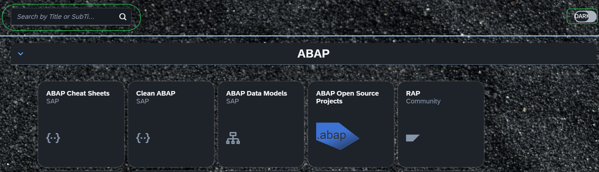

# Favorites

Static UI5 app for developer favorites. Implemented in VSCode starting with easy-ui5 yeoman generator template, then adding some code with fun.

Live site here: [https://attilaberencsi.github.io/favorites2/](https://attilaberencsi.github.io/favorites2/)

## Features

- Define Tile Groups with a Title, which are rendered below each other
- Sets the Group collapsed/expanded by default
- Define Tiles with Icons inside the group
- Define Quicklinks without icons
- Search capability: filters Tiles by Title and Subtitle
- Theme Switcher: Dark / Light

## Usage

Download this reporitory as ZIP.

Configure your favorite links to the [uimodule/model/favorites.json](uimodule/webapp/model/favorites.json) file.

## Build

`npm run build:ui`

## Deploy

Upload content of the `dist` folder to a web server like GitHub pages (github.io)

## Customization

To change background, replace [uimodule/resources/img/bg.jpg](uimodule/webapp/resources/img/bg.jpg) and [uimodule/resources/img/bgLight.jpg](uimodule/webapp/resources/img/bgLight.jpg) files.
